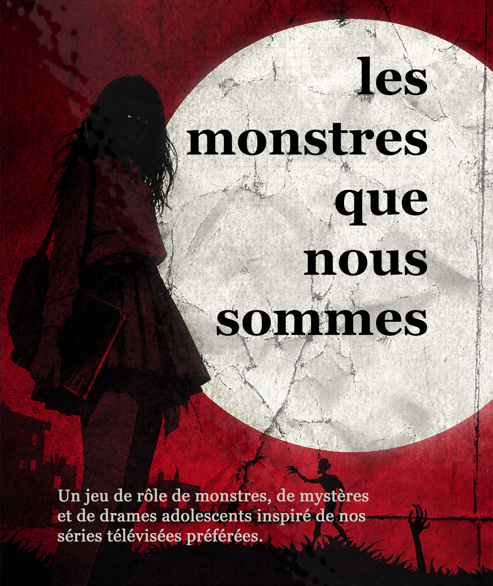

Les monstres que nous sommes est un jeu de rôle propulsant les joueurs dans un univers inspiré des séries télévisées telles que Buffy contre les Vampires ou Teen Wolf. Vous y interprétez des lycéens ou des jeunes adultes à l'université dans une petite ville fictive, entre mystère et horreur, faisant vous même partie des créatures qui hantent les nuits de la ville.

Le jeu propose un système accessible et met l'accent sur la montée en stress et la génération de drama inhérente à ce genre de cadres. Le jeu propose une génération assez complète de personnage incluant le cadre familial, différentes étapes de l'enfance pour créer des liens entre les joueurs, les complications familiales et personnelles, et va jusqu'à proposer un système de gestion académique (heureusement assez simple) pour générer des situations intéressantes et approfondir les relations entre élèves.
Les monstres que nous sommes en bref

- Un système de jeu au d100 à lecture directe quasiment sans calculs
- Douze compétences accompagnées de leurs spécialités
- Des résistances physiques et mentales amenant à gérer le stress et les traumas des personnages
- Une gestion simple d'équipement, de ressources, du niveau de vie, des économies et des dettes
- Une gestion simple de l'environnement académique créant une tension entre les résultats, la popularité et la sérénité
- Un système de relations avec les PNJ basé sur l'amitié (ou l'hostilité), le désir et l'admiration
- Des règles pour les créatures surnaturelles mettant en avant leurs côtés dramatiques, leurs particularités et leurs difficultés à garder la maîtrise d'elles-mêmes
  - Des vampires qui doivent composer avec leur soif et qui luttent contre la perversion de leur bête intérieure
  - Des loups-garous mus par leur faim de vivre mais menaçant de céder à leur rage primale
  - Des sorcières dotées d'un pouvoir appelant l'hubris et menaçant de les corrompre
  - Des leshy ressentant la pulsation de la nature et menaçant de s'attaquer à ce qui la détruit
  - Et bien d'autres à venir !
